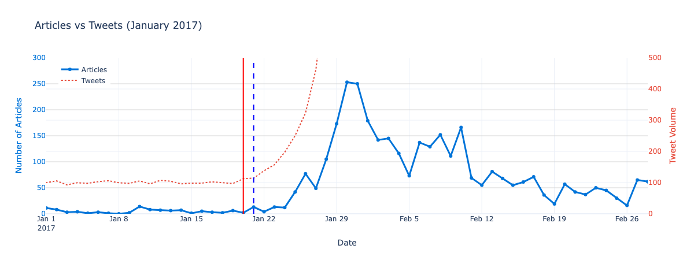

# GDELT × Twitter: Agenda-Setting in Immigration News

> A proof-of-concept data pipeline exploring whether U.S. news coverage of immigration *reacted to* spikes in social-media activity during Trump's first term — built around the 2017 "travel ban" (Executive Order 13769).



*Simulated tweet volume (red) spikes around the Jan 20 event, with measured news-article volume (blue) rising in the days that follow — the temporal pattern this project was designed to test.*

## 📋 Overview

This repository accompanies a University of Copenhagen *Elementary Social Data Science* exam project (Group 12). It pairs a written research-design paper with a Python notebook that prototypes the data pipeline the paper proposes. The notebook in this repo is the **methodological outline** — it demonstrates *how* the data collection and analysis would be carried out and tests its feasibility, rather than presenting a finished empirical result.

> **Note:** This is an outline / proof-of-concept. Because access to X's (Twitter) API was unavailable, the social-media side uses **simulated** tweet-volume data to validate the analysis approach. The news side uses real data from the GDELT API.

## 📄 The Research Paper (summary)

The accompanying paper develops the full research design. Its key elements:

**Research question:** *Did Twitter discussions on immigration topics precede major news coverage during Donald Trump's first presidency (2017–2021)?* The motivation: Trump used Twitter to bypass traditional media and set the agenda directly, raising the question of whether journalism became *reactive* to social-media attention on immigration.

- **Hypotheses:** H₀ — increases in Twitter discussion did *not* precede news coverage; H₁ — they *did*. The study would be pre-registered on the Open Science Framework to guard against selective reporting.
- **Design:** A quantitative, **data-triangulation** approach combining two ready-made API data sources with one custom-made dataset:
  - **News (GDELT 2.0 DOC API):** articles from Forbes, CNN, The New York Times, and The Washington Post, restricted to English / U.S. sources, filtered by keyword and word-proximity, deduplicated by title + domain.
  - **Twitter (X API, Pro tier via `tweepy`):** tweets matching event-specific hashtags identified with the PM-HRec hashtag-mining framework, over one-month windows before/after each immigration-policy event.
  - **Survey (custom-made / "enriched asking"):** a 5-point Likert survey of journalists and editors who worked at those outlets, recruited via LinkedIn, to capture their reflections on social media's influence on their reporting.
- **Operationalization:** a "spike" in Twitter discussion = daily tweet volume exceeding a 7-day moving average by **more than two standard deviations** (anomaly detection); news response = the first noticeable rise in article volume. The temporal lead/lag between the two is the object of analysis (inspired by Shapiro & Hemphill's methodology).
- **Sample-size justification:** "Planning for Precision" (95% CI, ±0.3 margin, sd ≈ 1.39) yields a target of **83 survey responses**, implying outreach to ~277 journalists at an assumed 30% response rate.
- **Critical evaluation:** the paper weighs feasibility (LinkedIn outreach/anti-spam limits, X's ~$5,000/month Pro-tier cost), ethics, reliability, and validity (selection bias from non-probability LinkedIn sampling, recall bias over a ~10-year span), and proposes future extensions — an experimental design for causal inference, and a longitudinal comparison spanning the Trump and Biden presidencies.

**This notebook implements a vertical slice of that design:** the real GDELT news-collection pipeline plus a *simulated* stand-in for the Twitter spike-detection step, demonstrating end-to-end feasibility.

## ✨ What it does

- **Collects real news data** from the [GDELT Doc 2.0 API](https://blog.gdeltproject.org/gdelt-doc-2-0-api-debuts/) via the [`gdeltdoc`](https://github.com/alex9smith/gdelt-doc-api) wrapper — filtering by proximity keywords ("travel ban", "muslim ban", "executive order 13769"), major U.S. outlets (NYT, Washington Post, CNN, Fox News), and a Jan–Mar 2017 window.
- **Beats the API rate limit** by looping day-by-day (max 250 articles/request) and parallelizing requests with a `ThreadPoolExecutor`.
- **Cleans and filters** the article set — English-language, U.S.-sourced, title keyword matching, and deduplication by title + domain.
- **Simulates a tweet-volume series** with a baseline plus an exponential surge after the hypothetical event date (Jan 20, 2017).
- **Detects volume spikes** using a rolling 7-day baseline and a mean + 2σ threshold to identify when social-media activity surges.
- **Visualizes the comparison** of daily article counts against tweet volume on a dual-axis Plotly chart.

## 🛠 Tech Stack

- **Language:** Python 3 (Jupyter Notebook)
- **Data source:** GDELT Doc 2.0 API (`gdeltdoc`)
- **Data & analysis:** pandas, NumPy
- **Visualization:** Plotly, Matplotlib
- **Utilities:** tqdm, `concurrent.futures` (threaded API fetching)

## 🚀 Getting Started

### Prerequisites
- Python 3.10+
- Jupyter (Notebook or Lab)

### Installation
```bash
git clone https://github.com/Jakob-Bell/News_Trend_Analysis.git
cd News_Trend_Analysis

# create and activate a virtual environment
python3 -m venv .venv
source .venv/bin/activate        # on Windows: .venv\Scripts\activate

# install dependencies
pip install -r requirements.txt
pip install jupyter
```

### Run it
```bash
jupyter notebook group12_api.ipynb
```
Run the cells top to bottom. The GDELT API requires **no API key**. The notebook fetches live article data, so an internet connection is needed; the tweet data is generated in-notebook.

## 📁 Project Structure
```
.
├── group12_api.ipynb      → the final analysis notebook (data collection → cleaning → spike detection → visualization)
├── requirements.txt       → Python dependencies
├── docs/
│   └── articles-vs-tweets.png         → key output visualization
├── README.md
└── LICENSE
```

## 🔬 Method at a glance

1. **News (real):** GDELT query → daily threaded pulls → filter & dedupe → daily article counts.
2. **Social (simulated):** hourly baseline volume + post-event exponential growth.
3. **Spike detection:** rolling baseline (7-day) + mean + 2σ threshold to flag the onset of a surge.
4. **Comparison:** overlay article counts and tweet volume to inspect lead/lag — the basis for testing whether news coverage *followed* social-media attention.

## ⚠️ Limitations

- Twitter data is **simulated**, not observed — results illustrate the method, not a real-world finding.
- The analysis is scoped to a single event (EO 13769) and a handful of U.S. outlets, limiting generalizability.
- A spike-threshold/correlation comparison is not a causal test; the paper discusses these reliability and validity concerns in detail.

## 👥 Authors

University of Copenhagen — Elementary Social Data Science, Group 12 (2025). Code primarily authored by the group; AI tools (ChatGPT, Copilot) were used for exploration, testing, and problem-solving.

## 📄 License

[MIT](LICENSE)
